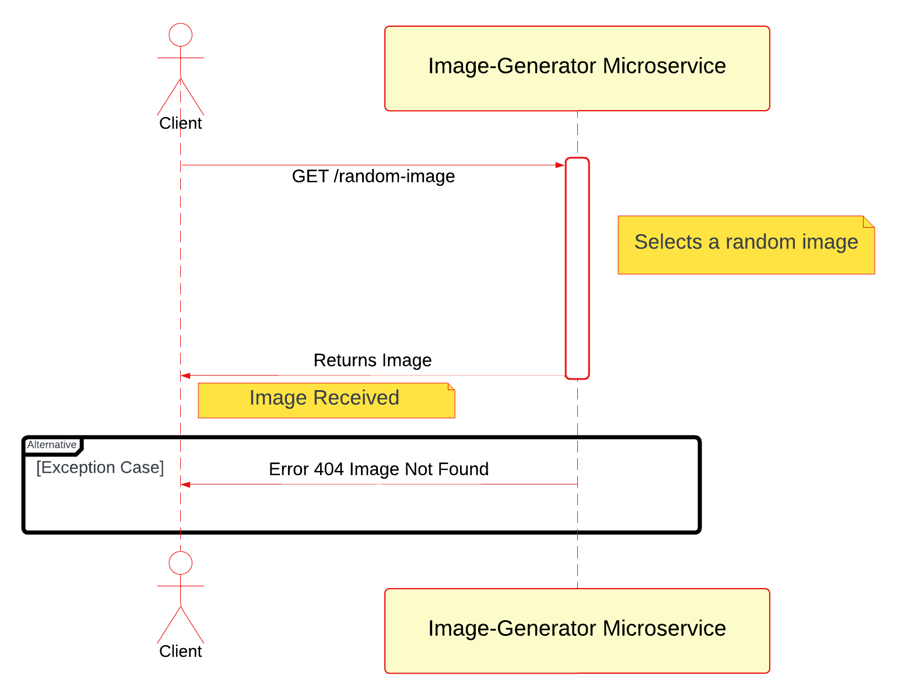

# Image-Generator Microservice

Welcome to the Image-Generator microservice! This REST API provides a unique functionality of serving random images from a curated collection. Designed with simplicity in mind, it allows developers to easily integrate random imagery into their applications or services.

## Getting Started

To use the Image-Generator microservice, you will need to make HTTP GET requests to our endpoint. The service is hosted on Heroku, ensuring high availability and ease of access.

## Prerequisites

No specific prerequisites are required to use this service. However, to interact with the API programmatically, you should have a basic understanding of HTTP requests and responses. Tools like curl, Postman, or programming languages such as Python with the requests library can be used to make these requests.

## Usage

### Requesting Data

To request a random Pokémon image, send a `GET` request to the following endpoint:

```
https://microservice-image-generator-bd1f70093a8a.herokuapp.com/random-image
```

#### Example Requests

##### Curl

Using curl: ```curl https://microservice-image-generator-bd1f70093a8a.herokuapp.com/random-image --output random_image.jpg```

The image will be saved to the current working directory when the command is executed.

##### Request Module

Using requests module: 

```
import requests
from PIL import Image
from io import BytesIO

# Microservice URL
url = 'https://microservice-image-generator-bd1f70093a8a.herokuapp.com/random-image'

# Send a GET request
response = requests.get(url)

# Check if the request was successful
if response.status_code == 200:
    # Open the image from the response content
    image = Image.open(BytesIO(response.content))
    # Display the image
    image.show()
else:
    print(f"Error: {response.status_code}, Description: {response.text}")
```

##### Browser

By simply inputting the URL: `https://microservice-image-generator-bd1f70093a8a.herokuapp.com/random-image` into a browser of choice, it will display the image.

### Receiving Data

The microservice responds with a random image file. The response content is the binary data of the image, which can be saved or displayed by the requesting application.

## Technical Details

This microservice is built using Python and Flask, a lightweight WSGI web application framework.

### Tech Stack

+ Programming Language: `Python`
+ Framework: `Flask`
+ Deployment Platform: `Heroku`

## UML Diagram

